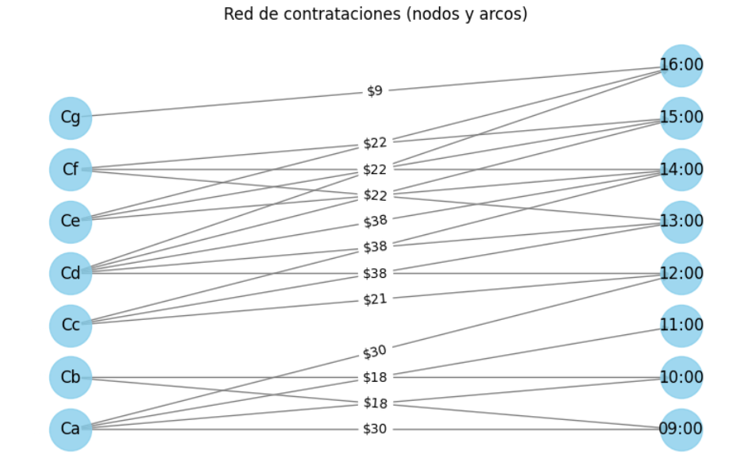

***Problema 1: Contratación de nuevos empleados (30 puntos)***

**CODIGO:**

```
import networkx as nx
import matplotlib.pyplot as plt
from gurobipy import Model, GRB

# Crear un grafo dirigido
G = nx.DiGraph()

# Nodos representando las horas
nodos = ['09:00', '10:00', '11:00', '12:00', '13:00', '14:00', '15:00', '16:00', 'Ca', 'Cb', 'Cc', 'Cd', 'Ce', 'Cf', 'Cg']
nodos_hora = ['09:00', '10:00', '11:00', '12:00', '13:00', '14:00', '15:00', '16:00']
nodos_contrataciones = ['Ca', 'Cb', 'Cc', 'Cd', 'Ce', 'Cf', 'Cg']

# Arcos con las contrataciones (inicio de contratación, fin de contratación)
arcos = [('Ca', '09:00'), ('Ca', '10:00'), ('Ca', '11:00'), ('Ca', '12:00'),
         ('Cb', '09:00'), ('Cb', '10:00'),
         ('Cc', '12:00'), ('Cc', '13:00'), ('Cc', '14:00'),
         ('Cd', '12:00'), ('Cd', '13:00'), ('Cd', '14:00'), ('Cd', '15:00'), ('Cd', '16:00'),
         ('Ce', '14:00'), ('Ce', '15:00'), ('Ce', '16:00'),
         ('Cf', '13:00'), ('Cf', '14:00'), ('Cf', '15:00'),
         ('Cg', '16:00')]

# Diccionario de costos para los arcos
costs = {(arcos[i]): c for i, c in enumerate([30, 30, 30, 30, 18, 18, 21, 21, 21, 38, 38, 38, 38, 38, 20, 20, 20, 22, 22, 22, 9])}

# Añadir los nodos al grafo
G.add_nodes_from(nodos)

# Añadir los arcos al grafo (inicio, fin, costo)
for inicio, fin in arcos:
    costo = costs[(inicio, fin)]  # Recuperar el costo del arco desde el diccionario
    G.add_edge(inicio, fin, weight=costo, label=f"${costo}")

# Posiciones de los nodos
pos = {}

for i, node in enumerate(nodos_contrataciones):
    pos[node] = (-1, i)

for i, node in enumerate(nodos_hora):
    pos[node] = (1, i)

# Graficar el grafo
plt.figure(figsize=(10, 6))

# Dibujar nodos
nx.draw_networkx_nodes(G, pos, node_size=1000, node_color='skyblue', alpha=0.8)
# Dibujar etiquetas de los nodos
nx.draw_networkx_labels(G, pos, font_size=12, font_color="black")
# Dibujar arcos con etiquetas de los costos
nx.draw_networkx_edges(G, pos, edgelist=G.edges(data=True), edge_color='gray', arrows=True)
# Dibujar etiquetas de los arcos
labels = nx.get_edge_attributes(G, 'label')
nx.draw_networkx_edge_labels(G, pos, edge_labels=labels)

plt.title('Red de contrataciones (nodos y arcos)')
plt.axis('off')  # Apagar los ejes
plt.show()

m = Model()

# Variables
x = m.addVars(arcos, obj=costs, vtype=GRB.BINARY, name="x")

for i in nodos_hora:
    m.addConstr(x.sum('*',i) == 1, f'Trabajo Check{i})')
    
m.optimize()

if m.Status == GRB.OPTIMAL:
    for edge in arcos:
        if x[edge].x > 0.5:
            print(f"Ruta desde {edge[0]} a {edge[1]}")
else:
    print('Es infactible')     
          
edges_taken = [edge for edge in arcos if x[edge].x > 0.5]

edge_colors = ['red' if edge in edges_taken else 'black' for edge in G.edges()]
nx.draw(G, pos, with_labels=True, node_size=700, node_color='skyblue', edge_color=edge_colors)
labels = nx.get_edge_attributes(G, 'weight')
nx.draw_networkx_edge_labels(G, pos, edge_labels=labels)

plt.title("Contrataciones")
plt.show()

if m.Status == GRB.OPTIMAL:
    print("Binary variable values for each arc:")
    for arc in arcos:
        print(f"Arc {arc}: {x[arc].x}")
```
**SOLUCIÓN**
```
Gurobi Optimizer version 11.0.3 build v11.0.3rc0 (win64 - Windows 11.0 (22631.2))

CPU model: 13th Gen Intel(R) Core(TM) i7-13620H, instruction set [SSE2|AVX|AVX2]
Thread count: 10 physical cores, 16 logical processors, using up to 16 threads

Optimize a model with 8 rows, 21 columns and 21 nonzeros
Model fingerprint: 0x53287347
Variable types: 0 continuous, 21 integer (21 binary)
Coefficient statistics:
  Matrix range     [1e+00, 1e+00]
  Objective range  [9e+00, 4e+01]
  Bounds range     [1e+00, 1e+00]
  RHS range        [1e+00, 1e+00]
Found heuristic solution: objective 238.0000000
Presolve removed 8 rows and 21 columns
Presolve time: 0.00s
Presolve: All rows and columns removed

Explored 0 nodes (0 simplex iterations) in 0.02 seconds (0.00 work units)
Thread count was 1 (of 16 available processors)

Solution count 2: 157 238 

Optimal solution found (tolerance 1.00e-04)
Best objective 1.570000000000e+02, best bound 1.570000000000e+02, gap 0.0000%
Ruta desde Ca a 11:00
Ruta desde Cb a 09:00
Ruta desde Cb a 10:00
Ruta desde Cc a 12:00
Ruta desde Cc a 13:00
Ruta desde Ce a 14:00
Ruta desde Ce a 15:00
Ruta desde Cg a 16:00
```

