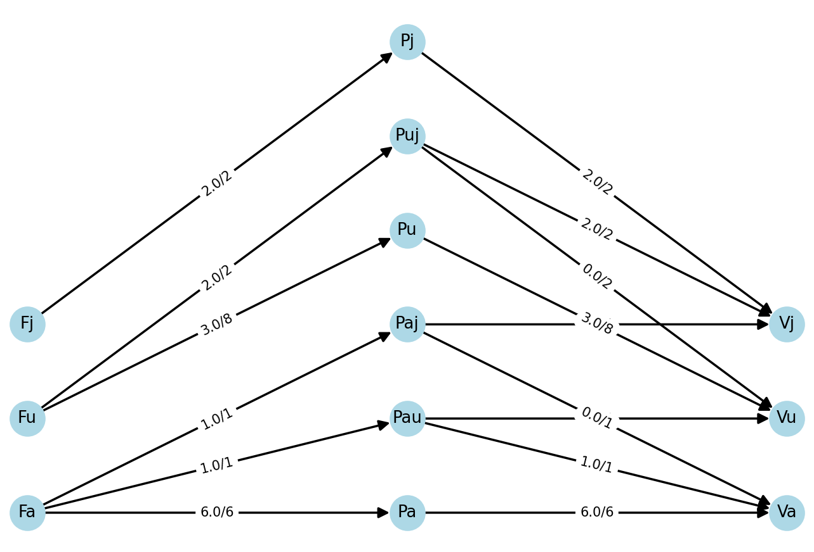
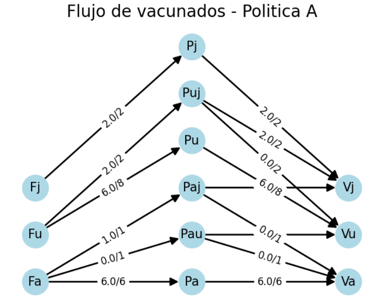
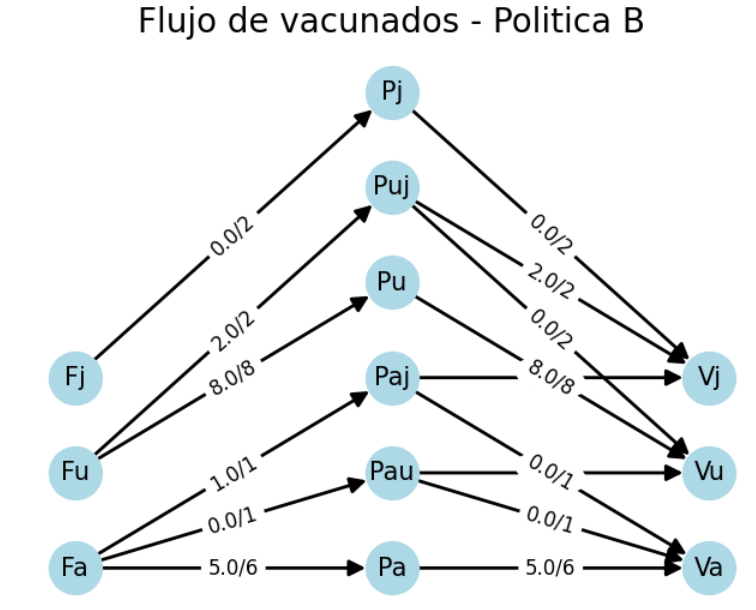

***CODIGO PROBLEMA 2: ESCENARIO BASE***
```import networkx as nx
import matplotlib.pyplot as plt
from gurobipy import Model, GRB

# Nodos de origen y destino
nodos = ['Fa','Fu','Fj','Pa', 'Pau', 'Paj', 'Pu', 'Puj', 'Pj', 'Va', 'Vu', 'Vj']
Nodos_paso = ['Pa', 'Pau', 'Paj', 'Pu', 'Puj', 'Pj']
Nodos_fuente = ['Fa','Fu','Fj']
Nodos_Destino = ['Va', 'Vu', 'Vj']

# Aristas (conexiones) entre los nodos
edges = [('Fa','Pa'),('Fa','Pau'),('Fa','Paj'),('Fu','Pu'),('Fu','Puj'),('Fj','Pj'),
         ('Pa', 'Va'), ('Pau', 'Va'), ('Pau', 'Vu'), ('Paj', 'Va'), ('Paj', 'Vj'), 
         ('Pu', 'Vu'), ('Puj', 'Vu'), ('Puj', 'Vj'), ('Pj', 'Vj')]

# Capacidades para las aristas
capacidades = {
    ('Fa','Pa') : 6, ('Fa','Pau') : 1, ('Fa','Paj'): 1, ('Fu','Pu'): 8, ('Fu','Puj'): 2,
    ('Fj','Pj'): 2, ('Pa', 'Va'): 6, ('Pau', 'Va'): 1, ('Pau', 'Vu'): 1, ('Paj', 'Va'): 1, 
    ('Paj', 'Vj'): 1, ('Pu', 'Vu'): 8, ('Puj', 'Vu'): 2, ('Puj', 'Vj'): 2, ('Pj', 'Vj'): 2
}

# Suministro para los nodos de origen
suministro = {'Fa': 8,'Fu':10 , 'Fj':2 }

# Crear el grafo
G = nx.DiGraph()

# Añadir aristas con capacidades al grafo
for edge, capacity in capacidades.items():
    G.add_edge(edge[0], edge[1], capacity=capacity)

# Añadir nodos de origen y asignarles el atributo de suministro
for i in nodos:
    G.add_node(i, value=suministro.get(i, 0))  # Si no existe en supply, asigna 0

### Modelo

# Crear el modelo
m = Model()

# Variables de decisión (flujo en cada arco) con capacidades
flow = m.addVars(edges, lb=0, ub=[capacidades[edge] for edge in edges], name="flow")

# Restricciones de flujo para los nodos destino
for i in nodos:
    if i == 'Va':  # Vacunación Acandí
        m.addConstr(flow.sum('*', i) <= 8, f"Restricción Nodo {i}")
    elif i == 'Vu':  # Vacunación Ug
        m.addConstr(flow.sum('*', i) <= 3, f"Restricción Nodo {i}")
    elif i == 'Vj':  # Vacunación J
        m.addConstr(flow.sum('*', i) <= 7, f"Restricción Nodo {i}")

for i in Nodos_fuente:
    m.addConstr(flow.sum(i, '*') >= 0, f"Supply_{i}")

# Restricción de conservación de flujo para nodos de paso
for i in Nodos_paso:
    m.addConstr(flow.sum('*', i) == flow.sum(i, '*'), f"Paso_{i}")

# Función objetivo: Maximizar el flujo entrante a los nodos Va, Vu y Vj
m.setObjective(flow.sum('*', 'Va') + flow.sum('*', 'Vu') + flow.sum('*', 'Vj'), GRB.MAXIMIZE)

# Optimizar
m.optimize()

#Verificación que el modelo sea factible, si no lo es, que indique cuales son las restricciones con problemas.
if m.Status == GRB.INFEASIBLE:
    print("El modelo es infactible. Buscando IIS...")
    m.computeIIS()
    print("Las siguientes restricciones son conflictivas:")
    for r in m.getConstrs():
        if r.IISConstr:
            print(r.constrName)
            
if m.Status != GRB.OPTIMAL:
    print("No se encontró solución óptima. Estado del modelo:", m.Status)
    exit() 

# Imprimir solución
print("\nFlujos óptimos en cada arista:")
for edges, variable in flow.items():
    print(f"Flujo desde {edges[0]} hacia {edges[1]}: {flow[edges]}/{capacidades[edges]}")

#Actualizar Grafo
for edge, variable in flow.items():
    G[edge[0]][edge[1]]['flow'] = variable.X

# Visualización con NetworkX - Grafo Inicial

pos = {}

# Left nodes on the left (x=-1)
for i, node in enumerate(Nodos_fuente):
    pos[node] = (-1, i)

# Center nodes (x=0)
for i, node in enumerate(Nodos_paso):
    pos[node] = (0, i)

# Right nodes on the right (x=1)
for i, node in enumerate(Nodos_Destino):
    pos[node] = (1, i)
    
edge_labels = {(i, j): f"{G[i][j]['capacity']}" for i, j in G.edges()}
nx.draw(G, pos, with_labels=True, node_size=1000, node_color='lightgray', arrowsize=20, width=2, font_size=15)
nx.draw_networkx_edge_labels(G, pos, edge_labels=edge_labels, font_size=12)

plt.title("Grafo Inicial con Capacidades", size=20)
plt.show()

# Visualización con NetworkX - Grafo con Flujos

edge_labels_with_flow = {(i, j): f"{G[i][j]['flow']}/{G[i][j]['capacity']}" for i, j in G.edges()}
nx.draw(G, pos, with_labels=True, node_size=1000, node_color='lightblue', arrowsize=20, width=2, font_size=15)
nx.draw_networkx_edge_labels(G, pos, edge_labels=edge_labels_with_flow, font_size=12)

plt.title("Flujo Máximo de vacunados", size=20)
plt.show()
```

**Solución**
```
Optimize a model with 12 rows, 15 columns and 30 nonzeros
Model fingerprint: 0x1290b90d
Coefficient statistics:
  Matrix range     [1e+00, 1e+00]
  Objective range  [1e+00, 1e+00]
  Bounds range     [1e+00, 8e+00]
  RHS range        [3e+00, 8e+00]
Presolve removed 12 rows and 15 columns
Presolve time: 0.00s
Presolve: All rows and columns removed
Iteration    Objective       Primal Inf.    Dual Inf.      Time
       0    1.5000000e+01   0.000000e+00   0.000000e+00      0s

Solved in 0 iterations and 0.01 seconds (0.00 work units)
Optimal objective  1.500000000e+01

Flujos óptimos en cada arista:
Flujo desde Fa hacia Pa: <gurobi.Var flow[Fa,Pa] (value 6.0)>/6
Flujo desde Fa hacia Pau: <gurobi.Var flow[Fa,Pau] (value 1.0)>/1
Flujo desde Fa hacia Paj: <gurobi.Var flow[Fa,Paj] (value 1.0)>/1
Flujo desde Fu hacia Pu: <gurobi.Var flow[Fu,Pu] (value 3.0)>/8
Flujo desde Fu hacia Puj: <gurobi.Var flow[Fu,Puj] (value 2.0)>/2
Flujo desde Fj hacia Pj: <gurobi.Var flow[Fj,Pj] (value 2.0)>/2
Flujo desde Pa hacia Va: <gurobi.Var flow[Pa,Va] (value 6.0)>/6
Flujo desde Pau hacia Va: <gurobi.Var flow[Pau,Va] (value 1.0)>/1
Flujo desde Pau hacia Vu: <gurobi.Var flow[Pau,Vu] (value 0.0)>/1
Flujo desde Paj hacia Va: <gurobi.Var flow[Paj,Va] (value 0.0)>/1
Flujo desde Paj hacia Vj: <gurobi.Var flow[Paj,Vj] (value 1.0)>/1
Flujo desde Pu hacia Vu: <gurobi.Var flow[Pu,Vu] (value 3.0)>/8
Flujo desde Puj hacia Vu: <gurobi.Var flow[Puj,Vu] (value 0.0)>/2
Flujo desde Puj hacia Vj: <gurobi.Var flow[Puj,Vj] (value 2.0)>/2
Flujo desde Pj hacia Vj: <gurobi.Var flow[Pj,Vj] (value 2.0)>/2
```


***CODIGO PROBLEMA 2: ESCENARIO POLITICA 2***
```
import networkx as nx
import math 
import matplotlib.pyplot as plt
from gurobipy import Model, GRB

# Nodos de origen y destino
nodos = ['Fa','Fu','Fj','Pa', 'Pau', 'Paj', 'Pu', 'Puj', 'Pj', 'Va', 'Vu', 'Vj']
Nodos_paso = ['Pa', 'Pau', 'Paj', 'Pu', 'Puj', 'Pj']
Nodos_fuente = ['Fa','Fu','Fj']
Nodos_Destino = ['Va','Vu','Vj']

Acceso_personas = {'Va': 8,'Vu': 12, 'Vj': 5}
Total_vacunas = 18
vacunas = {}

for i in Nodos_Destino:
    vacunas[i] = math.floor((Acceso_personas[i] / sum(Acceso_personas.values())) * Total_vacunas)
    
print(vacunas)


# Aristas (conexiones) entre los nodos
edges = [('Fa','Pa'),('Fa','Pau'),('Fa','Paj'),('Fu','Pu'),('Fu','Puj'),('Fj','Pj'),
         ('Pa', 'Va'), ('Pau', 'Va'), ('Pau', 'Vu'), ('Paj', 'Va'), ('Paj', 'Vj'), 
         ('Pu', 'Vu'), ('Puj', 'Vu'), ('Puj', 'Vj'), ('Pj', 'Vj')]

# Capacidades para las aristas
capacidades = {
    ('Fa','Pa') : 6, ('Fa','Pau') : 1, ('Fa','Paj'): 1, ('Fu','Pu'): 8, ('Fu','Puj'): 2,
    ('Fj','Pj'): 2, ('Pa', 'Va'): 6, ('Pau', 'Va'): 1, ('Pau', 'Vu'): 1, ('Paj', 'Va'): 1, 
    ('Paj', 'Vj'): 1, ('Pu', 'Vu'): 8, ('Puj', 'Vu'): 2, ('Puj', 'Vj'): 2, ('Pj', 'Vj'): 2
}

# Suministro para los nodos de origen
suministro = {'Fa': 8,'Fu':10 , 'Fj':2 }

# Crear el grafo
G = nx.DiGraph()

# Añadir aristas con capacidades al grafo
for edge, capacity in capacidades.items():
    G.add_edge(edge[0], edge[1], capacity=capacity)

# Añadir nodos de origen y asignarles el atributo de suministro
for i in nodos:
    G.add_node(i, value=suministro.get(i, 0))  # Si no existe en supply, asigna 0

### Modelo

# Crear el modelo
m = Model()

# Variables de decisión (flujo en cada arco) con capacidades
flow = m.addVars(edges, lb=0, ub=[capacidades[edge] for edge in edges], name="flow")

# Restricciones de flujo para los nodos destino
for i in nodos:
    if i == 'Va':  # Vacunación Acandí
        m.addConstr(flow.sum('*', i) <= vacunas[i], f"Restricción Nodo {i}")
    elif i == 'Vu':  # Vacunación Ug
        m.addConstr(flow.sum('*', i) <= vacunas[i], f"Restricción Nodo {i}")
    elif i == 'Vj':  # Vacunación J
        m.addConstr(flow.sum('*', i) <= vacunas[i], f"Restricción Nodo {i}")

for i in Nodos_fuente:
    m.addConstr(flow.sum(i, '*') >= 0, f"Supply_{i}")

# Restricción de conservación de flujo para nodos de paso
for i in Nodos_paso:
    m.addConstr(flow.sum('*', i) == flow.sum(i, '*'), f"Paso_{i}")

# Función objetivo: Maximizar el flujo entrante a los nodos Va, Vu y Vj
m.setObjective(flow.sum('*', 'Va') + flow.sum('*', 'Vu') + flow.sum('*', 'Vj'), GRB.MAXIMIZE)

# Optimizar
m.optimize()

#Verificación que el modelo sea factible, si no lo es, que indique cuales son las restricciones con problemas.
if m.Status == GRB.INFEASIBLE:
    print("El modelo es infactible. Buscando IIS...")
    m.computeIIS()
    print("Las siguientes restricciones son conflictivas:")
    for r in m.getConstrs():
        if r.IISConstr:
            print(r.constrName)
            
if m.Status != GRB.OPTIMAL:
    print("No se encontró solución óptima. Estado del modelo:", m.Status)
    exit() 

# Imprimir solución
print("\nFlujos óptimos en cada arista:")
for edges, variable in flow.items():
    print(f"Flujo desde {edges[0]} hacia {edges[1]}: {flow[edges]}/{capacidades[edges]}")

#Actualizar Grafo
for edge, variable in flow.items():
    G[edge[0]][edge[1]]['flow'] = variable.X

# Visualización con NetworkX - Grafo Inicial
pos = {}

# Left nodes on the left (x=-1)
for i, node in enumerate(Nodos_fuente):
    pos[node] = (-1, i)

# Center nodes (x=0)
for i, node in enumerate(Nodos_paso):
    pos[node] = (0, i)

# Right nodes on the right (x=1)
for i, node in enumerate(Nodos_Destino):
    pos[node] = (1, i)
    
edge_labels = {(i, j): f"{G[i][j]['capacity']}" for i, j in G.edges()}
nx.draw(G, pos, with_labels=True, node_size=1000, node_color='lightgray', arrowsize=20, width=2, font_size=15)
nx.draw_networkx_edge_labels(G, pos, edge_labels=edge_labels, font_size=12)

plt.title("Grafo Inicial con Capacidades", size=20)
plt.show()

# Visualización con NetworkX - Grafo con Flujos
edge_labels_with_flow = {(i, j): f"{G[i][j]['flow']}/{G[i][j]['capacity']}" for i, j in G.edges()}
nx.draw(G, pos, with_labels=True, node_size=1000, node_color='lightblue', arrowsize=20, width=2, font_size=15)
nx.draw_networkx_edge_labels(G, pos, edge_labels=edge_labels_with_flow, font_size=12)

plt.title("Flujo de vacunados - Politica B", size=20)
plt.show()
```
**Solución**
```
Optimize a model with 12 rows, 15 columns and 30 nonzeros
Model fingerprint: 0x881c7253
Coefficient statistics:
  Matrix range     [1e+00, 1e+00]
  Objective range  [1e+00, 1e+00]
  Bounds range     [1e+00, 8e+00]
  RHS range        [6e+00, 6e+00]
Presolve removed 12 rows and 15 columns
Presolve time: 0.01s
Presolve: All rows and columns removed
Iteration    Objective       Primal Inf.    Dual Inf.      Time
       0    1.7000000e+01   0.000000e+00   0.000000e+00      0s

Solved in 0 iterations and 0.02 seconds (0.00 work units)
Optimal objective  1.700000000e+01

Flujos óptimos en cada arista:
Flujo desde Fa hacia Pa: <gurobi.Var flow[Fa,Pa] (value 6.0)>/6
Flujo desde Fa hacia Pau: <gurobi.Var flow[Fa,Pau] (value 0.0)>/1
Flujo desde Fa hacia Paj: <gurobi.Var flow[Fa,Paj] (value 1.0)>/1
...
Flujo desde Pu hacia Vu: <gurobi.Var flow[Pu,Vu] (value 6.0)>/8
Flujo desde Puj hacia Vu: <gurobi.Var flow[Puj,Vu] (value 0.0)>/2
Flujo desde Puj hacia Vj: <gurobi.Var flow[Puj,Vj] (value 2.0)>/2
Flujo desde Pj hacia Vj: <gurobi.Var flow[Pj,Vj] (value 2.0)>/2
```


***CODIGO PROBLEMA 2: ESCENARIO POLITICA 1***
```
# Nodos de origen y destino
nodos = ['Fa','Fu','Fj','Pa', 'Pau', 'Paj', 'Pu', 'Puj', 'Pj', 'Va', 'Vu', 'Vj']
Nodos_paso = ['Pa', 'Pau', 'Paj', 'Pu', 'Puj', 'Pj']
Nodos_fuente = ['Fa','Fu','Fj']
Nodos_Destino =['Va', 'Vu', 'Vj']

# Aristas (conexiones) entre los nodos
edges = [('Fa','Pa'),('Fa','Pau'),('Fa','Paj'),('Fu','Pu'),('Fu','Puj'),('Fj','Pj'),
         ('Pa', 'Va'), ('Pau', 'Va'), ('Pau', 'Vu'), ('Paj', 'Va'), ('Paj', 'Vj'), 
         ('Pu', 'Vu'), ('Puj', 'Vu'), ('Puj', 'Vj'), ('Pj', 'Vj')]

# Capacidades para las aristas
capacidades = {
    ('Fa','Pa') : 6, ('Fa','Pau') : 1, ('Fa','Paj'): 1, ('Fu','Pu'): 8, ('Fu','Puj'): 2,
    ('Fj','Pj'): 2, ('Pa', 'Va'): 6, ('Pau', 'Va'): 1, ('Pau', 'Vu'): 1, ('Paj', 'Va'): 1, 
    ('Paj', 'Vj'): 1, ('Pu', 'Vu'): 8, ('Puj', 'Vu'): 2, ('Puj', 'Vj'): 2, ('Pj', 'Vj'): 2
}

# Suministro para los nodos de origen
suministro = {'Fa': 8,'Fu':10 , 'Fj':2 }

# Crear el grafo
G = nx.DiGraph()

# Añadir aristas con capacidades al grafo
for edge, capacity in capacidades.items():
    G.add_edge(edge[0], edge[1], capacity=capacity)

# Añadir nodos de origen y asignarles el atributo de suministro
for i in nodos:
    G.add_node(i, value=suministro.get(i, 0))  # Si no existe en supply, asigna 0

### Modelo

# Crear el modelo
m = Model()

# Variables de decisión (flujo en cada arco) con capacidades
flow = m.addVars(edges, lb=0, ub=[capacidades[edge] for edge in edges], name="flow")

# Restricciones de flujo para los nodos destino
for i in nodos:
    if i == 'Va':  # Vacunación Acandí
        m.addConstr(flow.sum('*', i) <= 6, f"Restricción Nodo {i}")
    elif i == 'Vu':  # Vacunación Ug
        m.addConstr(flow.sum('*', i) <= 6, f"Restricción Nodo {i}")
    elif i == 'Vj':  # Vacunación J
        m.addConstr(flow.sum('*', i) <= 6, f"Restricción Nodo {i}")

for i in Nodos_fuente:
    m.addConstr(flow.sum(i, '*') >= 0, f"Supply_{i}")

# Restricción de conservación de flujo para nodos de paso
for i in Nodos_paso:
    m.addConstr(flow.sum('*', i) == flow.sum(i, '*'), f"Paso_{i}")

# Función objetivo: Maximizar el flujo entrante a los nodos Va, Vu y Vj
m.setObjective(flow.sum('*', 'Va') + flow.sum('*', 'Vu') + flow.sum('*', 'Vj'), GRB.MAXIMIZE)

# Optimizar
m.optimize()

#Verificación que el modelo sea factible, si no lo es, que indique cuales son las restricciones con problemas.
if m.Status == GRB.INFEASIBLE:
    print("El modelo es infactible. Buscando IIS...")
    m.computeIIS()
    print("Las siguientes restricciones son conflictivas:")
    for r in m.getConstrs():
        if r.IISConstr:
            print(r.constrName)
            
if m.Status != GRB.OPTIMAL:
    print("No se encontró solución óptima. Estado del modelo:", m.Status)
    exit() 

# Imprimir solución
print("\nFlujos óptimos en cada arista:")
for edges, variable in flow.items():
    print(f"Flujo desde {edges[0]} hacia {edges[1]}: {flow[edges]}/{capacidades[edges]}")

#Actualizar Grafo
for edge, variable in flow.items():
    G[edge[0]][edge[1]]['flow'] = variable.X

# Visualización con NetworkX - Grafo Inicial
pos = {}

# Left nodes on the left (x=-1)
for i, node in enumerate(Nodos_fuente):
    pos[node] = (-1, i)

# Center nodes (x=0)
for i, node in enumerate(Nodos_paso):
    pos[node] = (0, i)

# Right nodes on the right (x=1)
for i, node in enumerate(Nodos_Destino):
    pos[node] = (1, i)

edge_labels = {(i, j): f"{G[i][j]['capacity']}" for i, j in G.edges()}
nx.draw(G, pos, with_labels=True, node_size=1000, node_color='lightgray', arrowsize=20, width=2, font_size=15)
nx.draw_networkx_edge_labels(G, pos, edge_labels=edge_labels, font_size=12)

plt.title("Grafo Inicial con Capacidades", size=20)
plt.show()

# Visualización con NetworkX - Grafo con Flujos

edge_labels_with_flow = {(i, j): f"{G[i][j]['flow']}/{G[i][j]['capacity']}" for i, j in G.edges()}
nx.draw(G, pos, with_labels=True, node_size=1000, node_color='lightblue', arrowsize=20, width=2, font_size=15)
nx.draw_networkx_edge_labels(G, pos, edge_labels=edge_labels_with_flow, font_size=12)

plt.title("Flujo de vacunados - Politica A", size=20)
plt.show()
```
**Solución**
```
Optimize a model with 12 rows, 15 columns and 30 nonzeros
Model fingerprint: 0x9936b955
Coefficient statistics:
  Matrix range     [1e+00, 1e+00]
  Objective range  [1e+00, 1e+00]
  Bounds range     [1e+00, 8e+00]
  RHS range        [3e+00, 8e+00]
Presolve removed 12 rows and 15 columns
Presolve time: 0.01s
Presolve: All rows and columns removed
Iteration    Objective       Primal Inf.    Dual Inf.      Time
       0    1.6000000e+01   0.000000e+00   0.000000e+00      0s

Solved in 0 iterations and 0.01 seconds (0.00 work units)
Optimal objective  1.600000000e+01

Flujos óptimos en cada arista:
Flujo desde Fa hacia Pa: <gurobi.Var flow[Fa,Pa] (value 5.0)>/6
...
Flujo desde Pu hacia Vu: <gurobi.Var flow[Pu,Vu] (value 8.0)>/8
Flujo desde Puj hacia Vu: <gurobi.Var flow[Puj,Vu] (value 0.0)>/2
Flujo desde Puj hacia Vj: <gurobi.Var flow[Puj,Vj] (value 2.0)>/2
Flujo desde Pj hacia Vj: <gurobi.Var flow[Pj,Vj] (value 0.0)>/2
```

