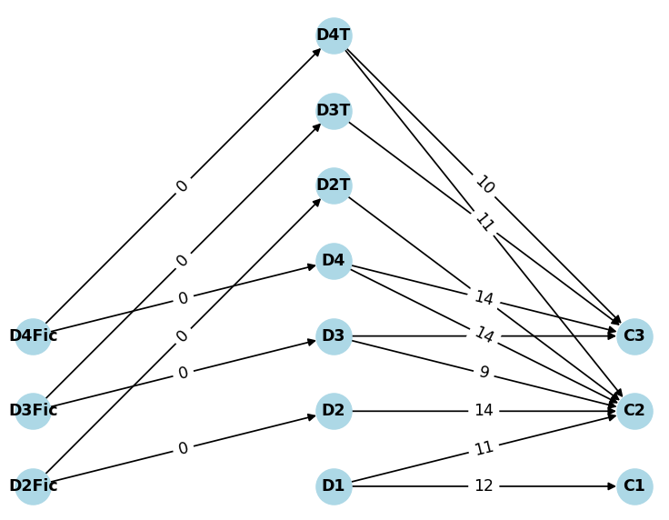
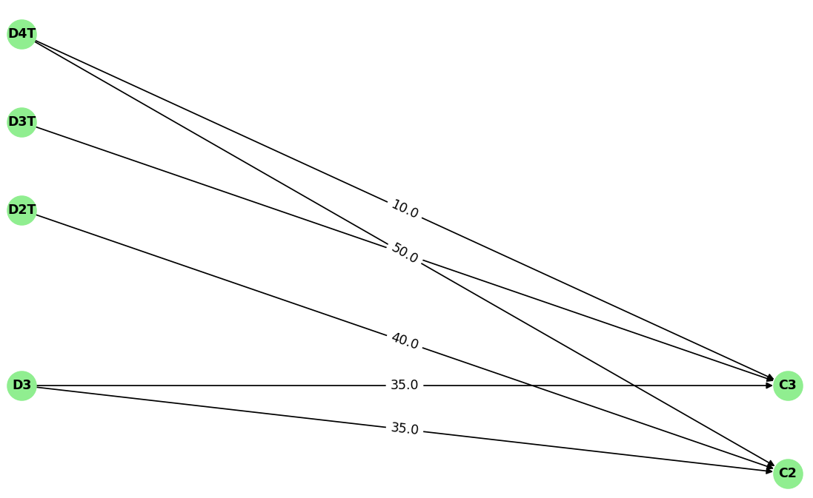

**Problema 3: Selección del modo de transporte (40 puntos)**
Codigo:
```
import networkx as nx
import matplotlib.pyplot as plt
from gurobipy import Model, GRB
import gurobipy as gp


# Conjuntos de nodos
depositos = ['D1', 'D2', 'D3', 'D4','D2T', 'D3T', 'D4T']  # Nodos de depósitos
centros = ['C1', 'C2', 'C3']  # Nodos de centros de distribución
nodos_ficticios = ['D2Fic','D3Fic','D4Fic']
Edges = [  ('D1', 'C1') ,('D1', 'C2'), ('D2Fic','D2T'),('D2Fic','D2'),
    ('D2T', 'C2'), ('D2', 'C2'),('D3Fic','D3T'),('D3Fic','D3'),
    ('D3T', 'C3'), ('D3', 'C2'), ('D3', 'C3'), ('D4Fic','D4T'),('D4Fic','D4'),
    ('D4T', 'C2'), ('D4T', 'C3'), ('D4', 'C2'),
    ('D4', 'C3')]

# Oferta en los depósitos (C_i^D)
oferta_Compartida = {'D1': 50,'D2Fic':40, 'D3Fic':35, 'D4Fic':65}

# Costos de transporte (c_ij) - Deberia poner costos 0 para conexion de Nodo ficticio a nodos de modos
costos = {
    ('D1', 'C1'): 12, ('D1', 'C2'): 11,('D2Fic','D2T'): 0,('D2Fic','D2'): 0,
    ('D2T', 'C2'): 12, ('D2', 'C2'): 14,('D3Fic','D3T'): 0,('D3Fic','D3'): 0,
    ('D3T', 'C3'):4, ('D3', 'C2'): 9, ('D3', 'C3'): 5,('D4Fic','D4T'): 0,('D4Fic','D4'): 0,
    ('D4T', 'C2'): 11, ('D4T', 'C3'): 10, ('D4', 'C2'): 14,
    ('D4', 'C3'): 14
}
capacidades= {
    ('D1', 'C1'): 50, ('D1', 'C2'): 50,('D2Fic','D2T'): 40,('D2Fic','D2'): 40,
    ('D2T', 'C2'): 40, ('D2', 'C2'): 40,('D3Fic','D3T'): 35,('D3Fic','D3'): 35,
    ('D3T', 'C3'):35, ('D3', 'C2'): 35, ('D3', 'C3'): 35,('D4Fic','D4T'): 65,('D4Fic','D4'): 65,
    ('D4T', 'C2'): 65, ('D4T', 'C3'): 65, ('D4', 'C2'): 65,
    ('D4', 'C3'): 65
}

edges_train = [('D2T', 'C2'),  ('D3T', 'C3'), ('D4T', 'C2'),('D4T', 'C3')]

G = nx.DiGraph()
for edge in Edges:
    G.add_edge(edge[0], edge[1], costo=costos[edge], capacidad=capacidades[edge])

pos = {}

# Nodos de fuente ficticios (IZQ)
for i, node in enumerate(nodos_ficticios):
    pos[node] = (-1, i)

# Nodes de deposito (CEN)
for i, node in enumerate(depositos):
    pos[node] = (0, i)

# Nodes de Destino (DER)
for i, node in enumerate(centros):
    pos[node] = (1, i)
    

# Dibujar el grafo
nx.draw(G, pos, with_labels=True, node_color='lightblue', node_size=500, font_size=10, font_weight='bold')
labels = nx.get_edge_attributes(G, 'costo')
nx.draw_networkx_edge_labels(G, pos, edge_labels=labels)

plt.show()

#Modelo
m = Model()
#Variable de decisión - Flujos en los arcos
flow = m.addVars(Edges,obj= costos, lb = 0, ub = capacidades, name= 'flow')
#Función objetivo
m.setObjective(flow.sum('*','C1')+ flow.sum('*','C2')
               +flow.sum('*','C3')+flow.sum('*','C4'), GRB.MINIMIZE)

#Restricciones 
#Capacidad de Tren
for i, j in edges_train:
    m.addConstr(flow[i, j] >= 10, f"MinCapacidad_{i}_{j}")
    m.addConstr(flow[i, j] <= 50, f"MaxCapacidad_{i}_{j}")
# Demanda satisfecha

m.addConstr(flow.sum('*','C1')+flow.sum('*','C2')+flow.sum('*','C3') == 180, 'Demanda satisfecha')
#Limite de oferta Como hago para que la capacidad de la red se respete.
for i in nodos_ficticios:
    m.addConstr(flow.sum(i, '*') <= oferta_Compartida[i], 'Oferta check 1') # Como hago para que sea 180
m.addConstr(flow.sum('D1','*') <= oferta_Compartida['D1'], 'oferta check 2') # Asumiendo que todo D1 se transporta.

m.optimize()
if m.status == GRB.OPTIMAL:
    for edge in Edges:
            print(f"Ruta desde {edge[0]} a {edge[1]} : {flow[edge].x}")
            
G_sol = nx.DiGraph()
    
for edge in Edges:
        if flow[edge].x > 0:  # Añadir solo los arcos con flujo positivo
            G_sol.add_edge(edge[0], edge[1], flujo=flow[edge].x)
    
    # Dibujar el grafo de la solución
nx.draw(G_sol, pos, with_labels=True, node_color='lightgreen', node_size=500, font_size=10, font_weight='bold')
    
    # Etiquetas de los flujos en los arcos
flow_labels = nx.get_edge_attributes(G_sol, 'flujo')
nx.draw_networkx_edge_labels(G_sol, pos, edge_labels=flow_labels)
    
plt.show()

    # Imprimir los valores de flujo
for edge in Edges:
    if flow[edge].x > 0:
        print(f"Ruta desde {edge[0]} a {edge[1]}: {flow[edge].x}")
```
**SOLUCIÓN**
```
Optimize a model with 13 rows, 17 columns and 27 nonzeros
Model fingerprint: 0x31a8224d
Coefficient statistics:
  Matrix range     [1e+00, 1e+00]
  Objective range  [1e+00, 1e+00]
  Bounds range     [4e+01, 7e+01]
  RHS range        [1e+01, 2e+02]
Presolve removed 13 rows and 17 columns
Presolve time: 0.01s
Presolve: All rows and columns removed
Iteration    Objective       Primal Inf.    Dual Inf.      Time
       0    1.8000000e+02   0.000000e+00   0.000000e+00      0s

Solved in 0 iterations and 0.01 seconds (0.00 work units)
Optimal objective  1.800000000e+02
Ruta desde D1 a C1 : 0.0
Ruta desde D1 a C2 : 0.0
Ruta desde D2Fic a D2T : 0.0
Ruta desde D2Fic a D2 : 0.0
Ruta desde D2T a C2 : 40.0
Ruta desde D2 a C2 : 0.0
Ruta desde D3Fic a D3T : 0.0
Ruta desde D3Fic a D3 : 0.0
Ruta desde D3T a C3 : 10.0
Ruta desde D3 a C2 : 35.0
Ruta desde D3 a C3 : 35.0
Ruta desde D4Fic a D4T : 0.0
Ruta desde D4Fic a D4 : 0.0
Ruta desde D4T a C2 : 50.0
Ruta desde D4T a C3 : 10.0
Ruta desde D4 a C2 : 0.0
Ruta desde D4 a C3 : 0.0
Ruta desde D2T a C2: 40.0
Ruta desde D3T a C3: 10.0
Ruta desde D3 a C2: 35.0
Ruta desde D3 a C3: 35.0
Ruta desde D4T a C2: 50.0
Ruta desde D4T a C3: 10.0
```
pd. Profe aqui tuve un problema y es que no se porque no salian los flujos desde los nodos del primer nivel.


